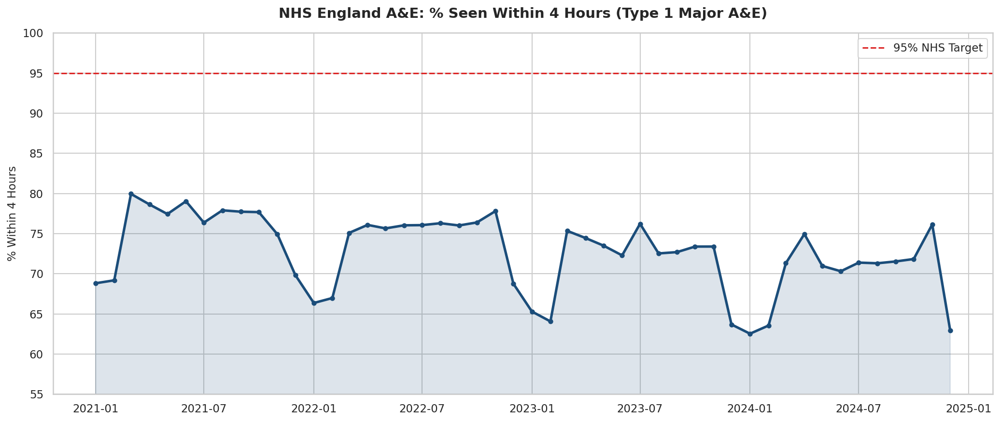
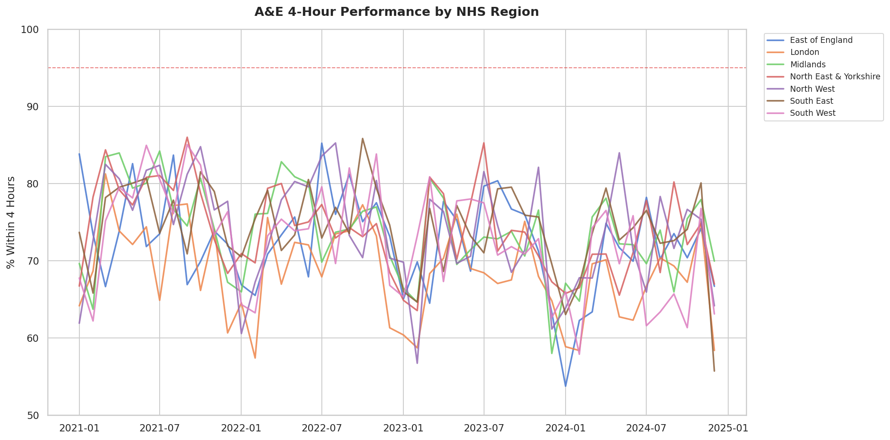
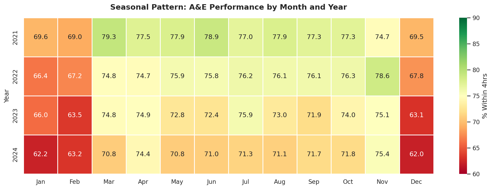
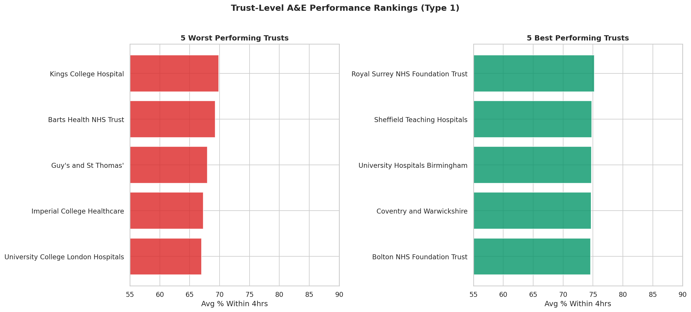
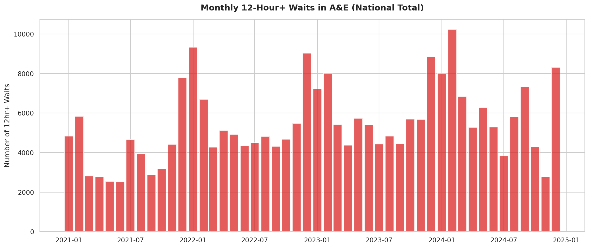

# 🏥 NHS A&E Wait Times Analysis

## Overview
An end-to-end analysis of NHS England A&E waiting times, exploring performance against the 4-hour target, seasonal patterns, regional disparities, and the growing crisis of 12-hour waits across hospital trusts.

## Key Findings

| Metric | Value |
|--------|-------|
| **Dataset** | 30+ NHS trusts, 7 regions, 48 months (2021–2024) |
| **4hr Target Met?** | ❌ Nationally below 95% every single month |
| **Winter Effect** | Performance drops ~8-10% in Dec–Feb |
| **Worst Region** | London — highest pressure, longest waits |
| **12hr Waits** | Increased significantly year-on-year since 2021 |

## Visualisations

### National Performance Trend


### Regional Comparison


### Seasonal Heatmap


### Trust Rankings


### 12-Hour Waits Crisis


## Tools & Technologies
- **Python**: Pandas, NumPy, Matplotlib, Seaborn
- **SQL**: SQLite with analytical queries, views, and window functions
- **Tableau**: Dashboard-ready CSV export included

## Project Structure
```
project-1-nhs-ae-analysis/
├── README.md
├── data/
│   ├── nhs_ae_raw_data.csv
│   ├── nhs_ae_analysis.db
│   └── nhs_ae_tableau_export.csv
├── notebooks/
│   └── nhs_ae_analysis.py
├── sql/
│   └── queries.sql
└── visualisations/
    ├── 01_national_4hr_trend.png
    ├── 02_regional_comparison.png
    ├── 03_seasonal_heatmap.png
    ├── 04_trust_rankings.png
    ├── 05_12hr_waits_crisis.png
    └── 06_attendance_volume.png
```

## Data Source
Simulated dataset based on patterns from [NHS England Statistical Work Areas](https://www.england.nhs.uk/statistics/statistical-work-areas/ae-waiting-times-and-activity/). Structure mirrors real NHS A&E Attendances & Emergency Admissions monthly publications.

## How to Run
```bash
cd project-1-nhs-ae-analysis
pip install pandas numpy matplotlib seaborn
python notebooks/nhs_ae_analysis.py
```

## SQL Highlights
The `sql/queries.sql` file includes 7 analytical queries covering:
- National monthly performance tracking
- Regional performance rankings
- Seasonal winter vs summer comparison
- Year-over-year trend analysis
- Trust-level 12-hour wait hotspots
- Month-on-month change calculations

## Author
[Zain Ali] — Aspiring Data Analyst | [LinkedIn](https://www.linkedin.com/in/zainali006/) | [Email](zaynaly90@gmail.com)
