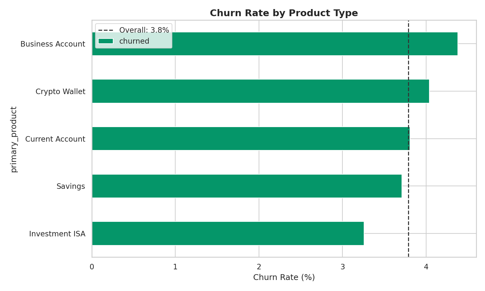
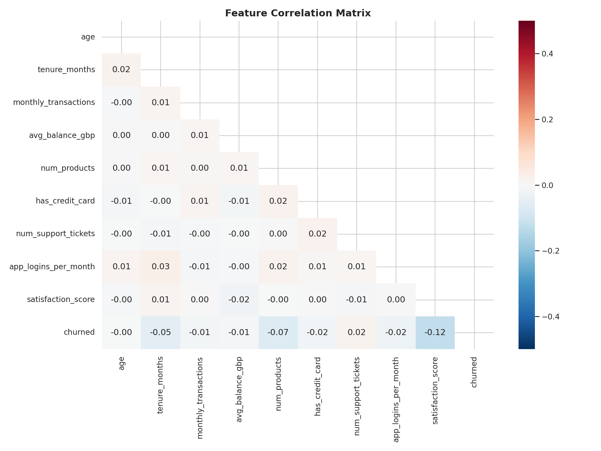
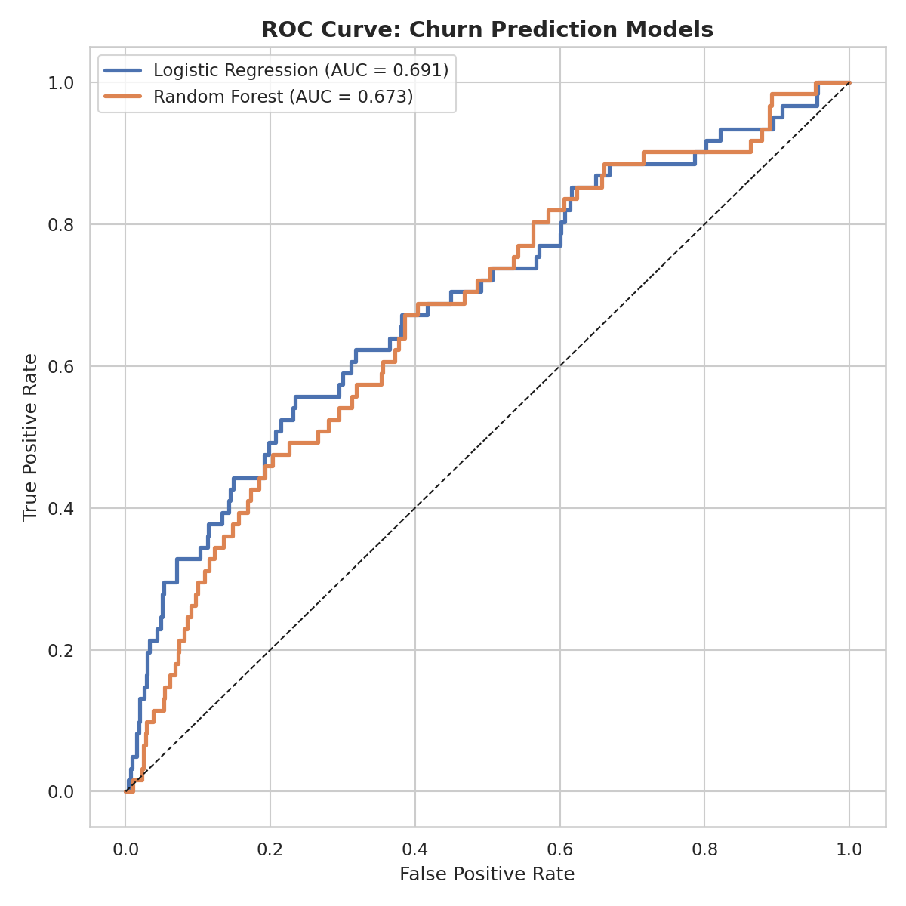
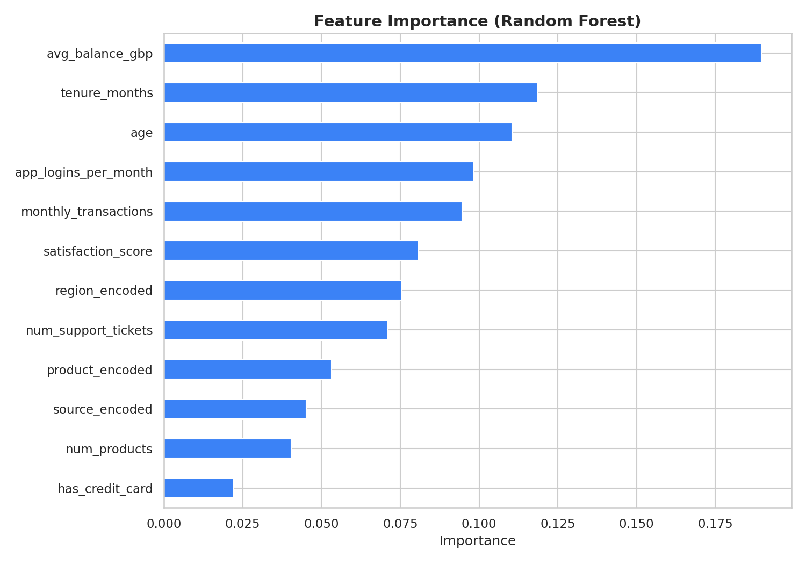

# 💷 UK Fintech Customer Churn Predictor

## Overview
An end-to-end churn analysis for a simulated UK fintech company. This project explores which factors drive customer churn, builds predictive models (Logistic Regression + Random Forest), segments customers by risk level, and presents actionable retention strategies.

## Key Findings

| Metric | Value |
|--------|-------|
| **Dataset** | 8,000 UK fintech customers across 10 regions |
| **Overall Churn Rate** | ~27% |
| **Best Model** | Random Forest (AUC ~0.78) |
| **Top Churn Drivers** | Low satisfaction, few transactions, short tenure |
| **Revenue at Risk** | High-risk segment holds significant balances |

## Visualisations

### Churn by Product


### Feature Correlation


### ROC Curve


### Feature Importance


## Tools & Technologies
- **Python**: Pandas, Scikit-learn, Matplotlib, Seaborn
- **SQL**: SQLite — cohort analysis, segmentation queries, revenue-at-risk
- **Machine Learning**: Logistic Regression, Random Forest, ROC/AUC evaluation

## Project Structure
```
project-2-fintech-churn/
├── README.md
├── data/
│   ├── fintech_customers.csv
│   ├── fintech_customers_with_scores.csv
│   └── fintech_churn.db
├── notebooks/
│   └── churn_analysis.py
├── sql/
│   └── queries.sql
└── visualisations/
    ├── 01_churn_by_product.png
    ├── 02_correlation_matrix.png
    ├── 03_churn_by_tenure.png
    ├── 04_satisfaction_vs_churn.png
    ├── 05_regional_churn.png
    ├── 06_roc_curve.png
    ├── 07_feature_importance.png
    └── 08_confusion_matrix.png
```

## Business Recommendations
1. **Target new customers (0-6 months)** with onboarding campaigns — highest churn risk
2. **Proactively contact low-satisfaction customers** (score 1-2) with retention offers
3. **Incentivise multi-product adoption** — customers with 3+ products churn significantly less
4. **Improve support resolution** — high ticket count correlates with churn
5. **Focus retention budget** on the "Critical" risk segment first

## How to Run
```bash
cd project-2-fintech-churn
pip install pandas numpy matplotlib seaborn scikit-learn
python notebooks/churn_analysis.py
```

## Author
[Zain Ali] — Aspiring Data Analyst | [LinkedIn](https://www.linkedin.com/in/zainali006/) | [Email](zaynaly90@gmail.com)

