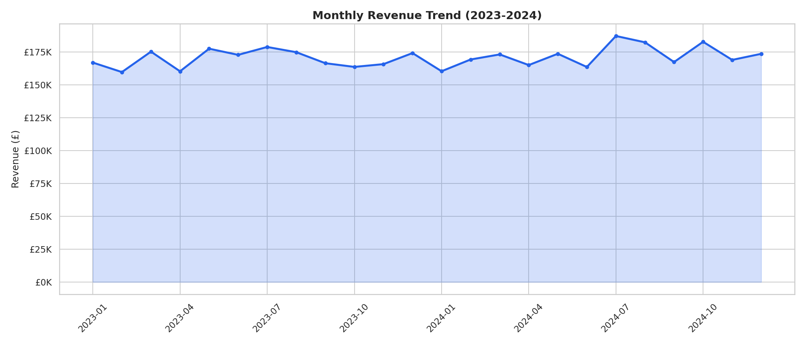
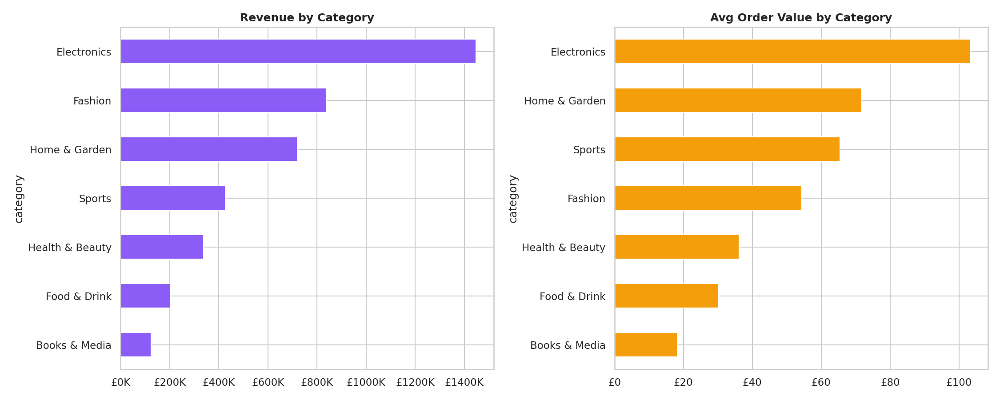
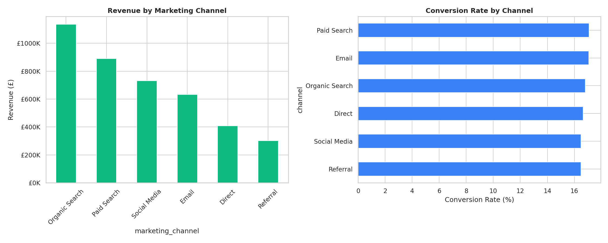

# 🛒 E-commerce Sales & Marketing Dashboard

## Overview
A comprehensive analysis of a fictional UK online retailer's performance across 25,000 orders and 150,000 web sessions. Designed to be imported into Power BI as a multi-page interactive dashboard.

## Key Metrics

| KPI | Value |
|-----|-------|
| **Total Revenue** | £2M+ (2023-2024) |
| **Total Orders** | 25,000 |
| **Avg Order Value** | ~£48 |
| **Conversion Rate** | ~17% |
| **Return Rate** | ~8% |

## Visualisations

### Monthly Revenue Trend


### Category Performance


### Marketing Channel Analysis


## Power BI Dashboard Design

The exported CSVs are structured for a 3-page Power BI report:

**Page 1 — Executive Overview**: Revenue trend, KPI cards, category breakdown
**Page 2 — Marketing Performance**: Channel ROI, conversion funnel, device split
**Page 3 — Regional Analysis**: UK map visual, regional KPIs, customer segmentation

### Data Model (Star Schema)
- **Fact Table**: `orders` (25K rows)
- **Fact Table**: `sessions` (150K rows)
- **Dimension**: Date, Region, Category, Channel, Device

## Tools & Technologies
- **Python**: Pandas, Matplotlib, Seaborn — data generation & EDA
- **SQL**: SQLite — KPI queries, channel ROI, customer LTV
- **Power BI**: Dashboard-ready CSV exports with proper data types
- **Excel**: Pivot table-ready format

## Project Structure
```
project-3-ecommerce-dashboard/
├── README.md
├── data/
│   ├── ecommerce_orders.csv
│   ├── website_sessions.csv
│   ├── powerbi_orders.csv
│   ├── powerbi_sessions.csv
│   └── ecommerce.db
├── notebooks/
│   └── ecommerce_analysis.py
├── sql/
│   └── queries.sql
└── visualisations/
    ├── 01_monthly_revenue.png — 06_regional_revenue.png
```

## How to Run
```bash
cd project-3-ecommerce-dashboard
pip install pandas numpy matplotlib seaborn
python notebooks/ecommerce_analysis.py
```

## Author
[Your Name] — Aspiring Data Analyst | [LinkedIn](your-link) | [Email](your-email)
