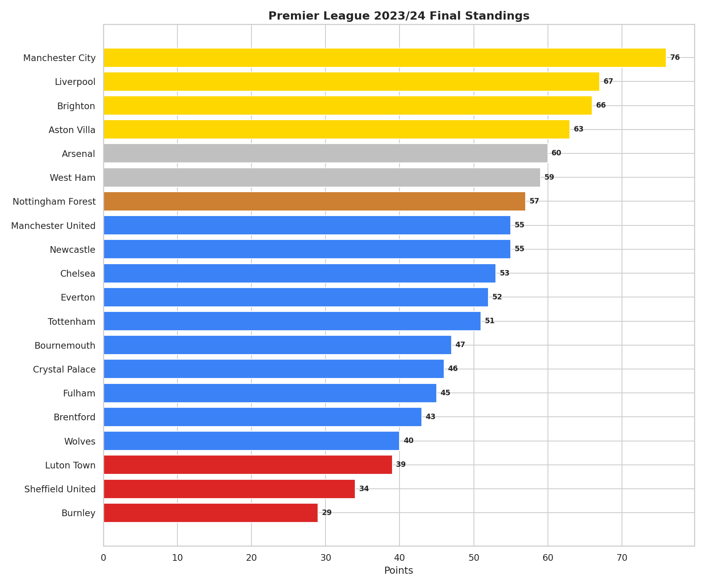
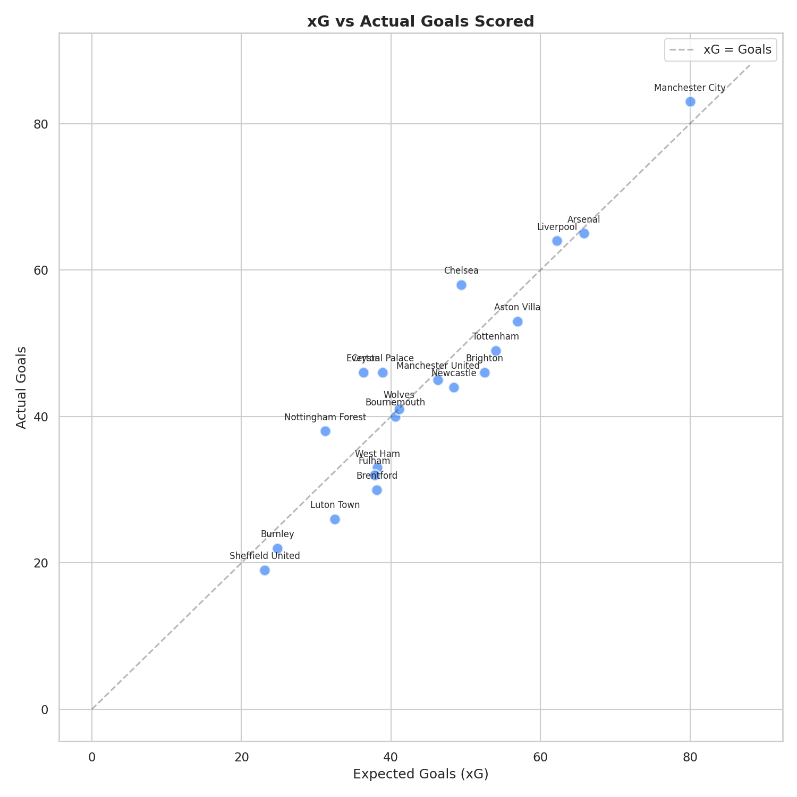
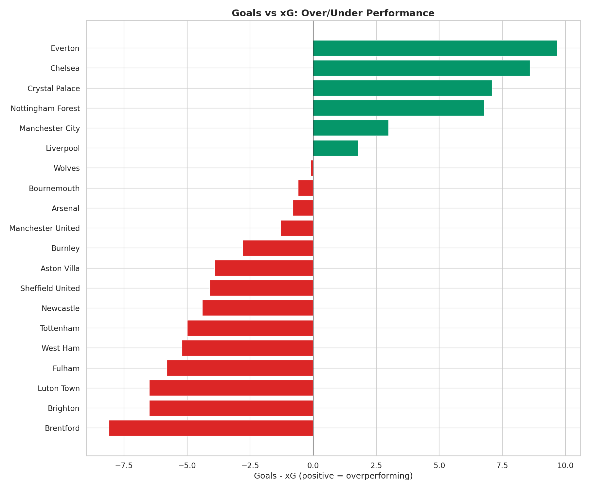

# ⚽ Premier League Performance Tracker (2023/24)

## Overview
A deep-dive analysis of the 2023/24 Premier League season, covering all 380 matches with xG (expected goals) analysis, home/away performance splits, form trends, and referee impact analysis.

## Key Findings

| Insight | Detail |
|---------|--------|
| **xG Leaders** | Manchester City & Arsenal generate the highest xG per match |
| **Home Advantage** | Teams win ~45% at home vs ~30% away |
| **xG Overperformers** | Some mid-table teams significantly outperform their xG |
| **Winter Form** | Title contenders show strongest form in Dec-Feb |

## Visualisations

### League Table


### xG vs Actual Goals


### xG Over/Under Performance


## Tools & Technologies
- **Python**: Pandas, NumPy, Matplotlib, Seaborn
- **SQL**: Match analysis, form tables, referee impact, xG efficiency
- **Tableau**: Dashboard-ready CSV export included

## Data
Simulated dataset based on realistic Premier League patterns. Structure mirrors data from FBref and Understat.

## Project Structure
```
project-4-premier-league-tracker/
├── README.md
├── data/
│   ├── pl_matches_2324.csv
│   ├── pl_table_2324.csv
│   ├── pl_tableau_export.csv
│   └── premier_league.db
├── notebooks/
│   └── pl_analysis.py
├── sql/
│   └── queries.sql
└── visualisations/
    ├── 01_league_table.png
    ├── 02_xg_vs_actual.png
    ├── 03_home_away.png
    ├── 04_goals_per_gw.png
    └── 05_xg_overperformance.png
```

## How to Run
```bash
cd project-4-premier-league-tracker
pip install pandas numpy matplotlib seaborn
python notebooks/pl_analysis.py
```

## Author
[Your Name] — Aspiring Data Analyst | [LinkedIn](your-link) | [Email](your-email)
