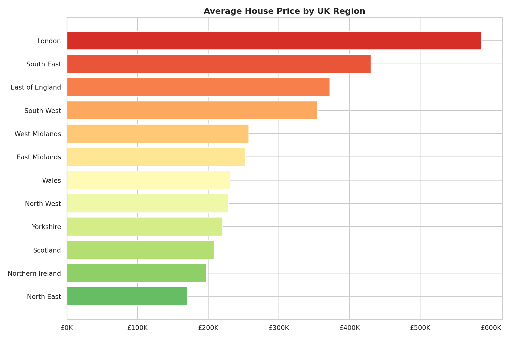
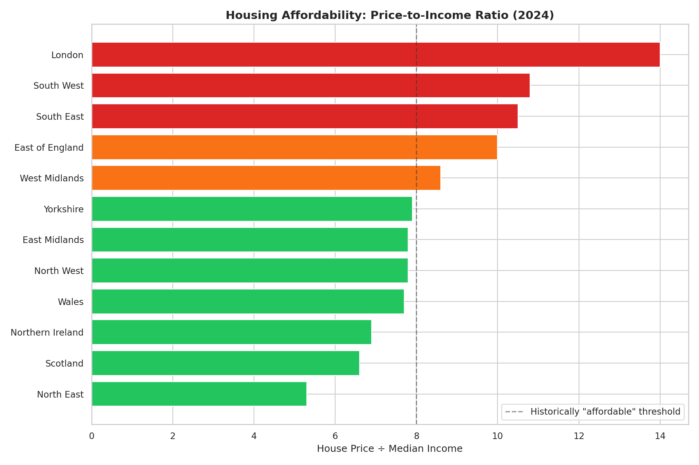
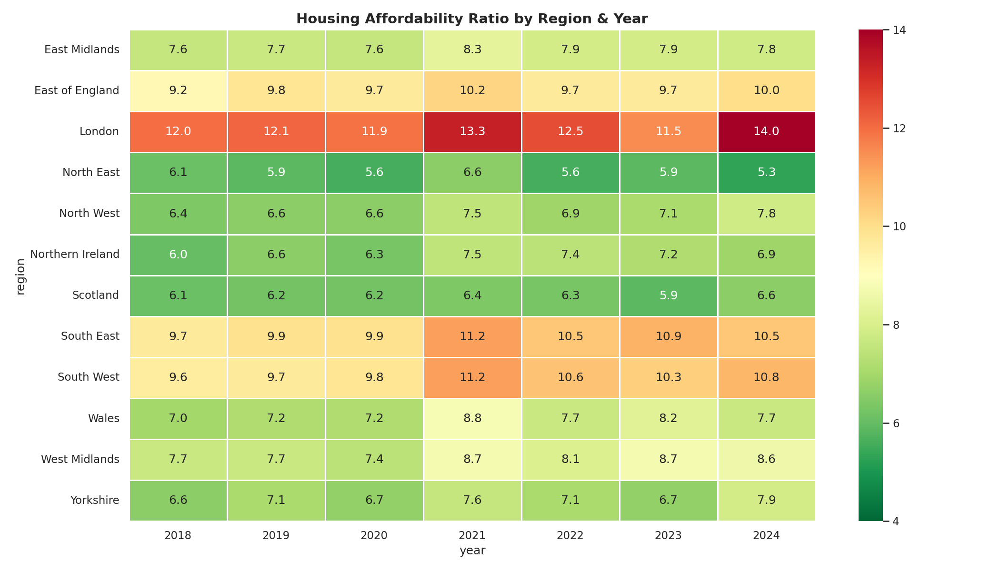

# 🏠 UK Housing Market Explorer

## Overview
Combining house price data with income statistics to explore housing affordability across all UK regions from 2018-2024. Includes price-to-income ratios, property type analysis, and first-time buyer affordability metrics.

## Key Findings

| Insight | Detail |
|---------|--------|
| **Most Expensive** | London — avg price ~£520K |
| **Least Affordable** | London — price-to-income ratio > 12x |
| **Most Affordable** | North East — ratio ~5.5x |
| **COVID Impact** | Prices dipped mid-2020, bounced with stamp duty holiday |
| **Rate Rise Effect** | 2023 saw first price corrections in several regions |

## Visualisations

### Regional Prices


### Affordability Ratio


### Affordability Heatmap


## Tools & Technologies
- **Python**: Pandas, NumPy, Matplotlib, Seaborn
- **SQL**: SQLite with joins, views, window functions, CTEs
- **Power BI**: Affordability dashboard-ready exports

## Data Sources
Simulated based on patterns from HM Land Registry Price Paid Data (gov.uk) and ONS Annual Survey of Hours and Earnings.

## Project Structure
```
project-5-uk-housing-explorer/
├── README.md
├── data/
│   ├── uk_house_prices.csv (50K transactions)
│   ├── regional_incomes.csv
│   ├── powerbi_affordability.csv
│   └── uk_housing.db
├── notebooks/
│   └── housing_analysis.py
├── sql/
│   └── queries.sql
└── visualisations/
    ├── 01-06 charts
```

## How to Run
```bash
cd project-5-uk-housing-explorer
pip install pandas numpy matplotlib seaborn
python notebooks/housing_analysis.py
```

## Author
[Your Name] — Aspiring Data Analyst | [LinkedIn](your-link) | [Email](your-email)
