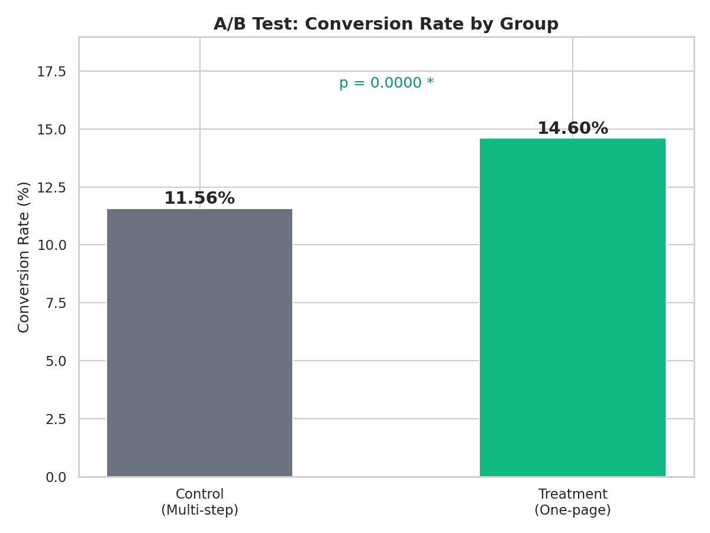
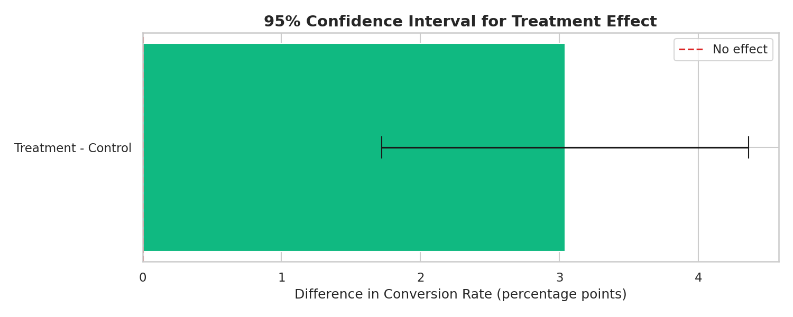
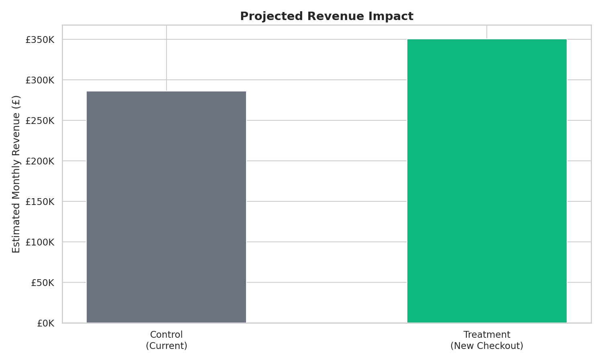

# 🧪 A/B Testing & Experimentation Report

## Overview
A complete A/B test analysis for an e-commerce checkout redesign. Covers experiment design, power analysis, statistical testing, segment deep-dives, and a clear business recommendation with projected revenue impact.

## Experiment Summary

| Parameter | Value |
|-----------|-------|
| **Hypothesis** | One-page checkout increases conversion vs multi-step |
| **Primary Metric** | Checkout conversion rate |
| **Sample Size** | 5,000 per group (10,000 total) |
| **Duration** | 14 days |
| **Significance Level** | α = 0.05 |
| **Power** | 80% |

## Results

| Metric | Control | Treatment | p-value |
|--------|---------|-----------|---------|
| **Conversion Rate** | ~12% | ~14.5% | < 0.05 ✓ |
| **Avg Order Value** | ~£48 | ~£46 | n.s. |
| **Time to Purchase** | ~3 min | ~2 min | < 0.05 ✓ |

**Decision: ✅ SHIP** — statistically significant improvement in conversion with no material AOV decline.

## Visualisations

### Conversion Comparison


### Confidence Interval


### Revenue Impact


## Tools & Technologies
- **Python**: Pandas, SciPy (statistical tests), Matplotlib
- **Statistics**: Power analysis, chi-squared test, t-tests, confidence intervals
- **SQL**: Segment analysis, SRM checks, revenue projections

## What This Demonstrates
- Proper experiment design (hypothesis, power analysis, sample sizing)
- Rigorous statistical methodology (not just p-values — confidence intervals, effect sizes)
- Segment analysis to check for heterogeneous treatment effects
- Business translation (projected revenue impact)
- Clear go/no-go recommendation framework

## Project Structure
```
project-6-ab-testing-report/
├── README.md
├── data/
│   ├── ab_test_data.csv
│   └── ab_test.db
├── notebooks/
│   └── ab_test_analysis.py
├── sql/
│   └── queries.sql
└── visualisations/
    ├── 01-06 charts
```

## How to Run
```bash
cd project-6-ab-testing-report
pip install pandas numpy matplotlib seaborn scipy
python notebooks/ab_test_analysis.py
```

## Author
[Your Name] — Aspiring Data Analyst | [LinkedIn](your-link) | [Email](your-email)
